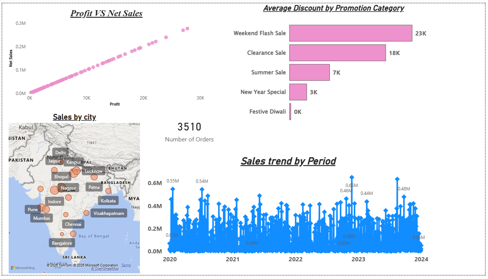

# 📊 Power BI Sales Dashboard

## 🚀 Project Overview

Built an interactive dashboard using Power BI to analyze sales performance and trends.

## 📌 Features

* Top/Bottom 5 products by Sales, Profit, Quantity
* Sales trends (Daily, Monthly, Yearly)
* Sales vs Profit analysis
* Compare two time periods
* Average discount by category
* Total number of orders
* Detailed order-level data with filters
* Sales by city (map)

---

### 📷 Dashboard Preview

### 📊 Overview

### 📈 Comparison of Sales and Profit

### 🔍 Top & Bottom 5 Analysis

### 📋 Table View

### 🎛️ Edit Interaction

---

## 🛠 Tools Used

* Power BI
* DAX
* Data Visualization

---

## 📁 File

* sales-dashboard.pbix
